# Mermaid Diagram for Image Identification Workflow

## Complete System Workflow

```mermaid
graph TD
    A[📱 iOS App<br/>User takes photo] --> B[🌐 Network Request<br/>POST /api/identify/photo]
    B --> C[🖥️ FastAPI Server<br/>localhost:8000]
    C --> D[🔧 Image Processing<br/>Validate & Compress]
    D --> E[🧠 AI Service<br/>identify_photo()]
    E --> F[🤖 OpenAI GPT-4 Vision<br/>Primary API]
    
    F --> G{Success?}
    G -->|Yes| H{Confidence ≥ 0.8?}
    H -->|Yes| I[✅ Return Result<br/>High Confidence]
    H -->|No| J[🌿 iNaturalist API<br/>Fallback]
    G -->|No| J
    
    J --> K{Success?}
    K -->|Yes| L[🔄 Compare Results<br/>Choose Best]
    K -->|No| M[🎭 Mock Data<br/>Development Fallback]
    
    L --> N[📋 JSON Response<br/>Species + Confidence]
    I --> N
    M --> N
    
    N --> O[📤 HTTP Response<br/>200 OK]
    O --> P[📱 iOS Display<br/>Show Results]
    
    style A fill:#e1f5fe
    style F fill:#f3e5f5
    style J fill:#e8f5e8
    style M fill:#fff3e0
    style P fill:#e1f5fe
```

## Detailed Component Diagram

```mermaid
graph LR
    subgraph "Client Side"
        A[📱 iOS App]
        B[📸 Photo Capture]
        C[🌐 HTTP Request]
    end
    
    subgraph "Network Layer"
        D[🌐 HTTPS POST]
        E[📡 Multipart Data]
    end
    
    subgraph "Backend Server"
        F[🖥️ FastAPI Server]
        G[🔧 Image Processing]
        H[🧠 AI Service]
    end
    
    subgraph "AI APIs"
        I[🤖 OpenAI GPT-4 Vision]
        J[🌿 iNaturalist API]
        K[🎭 Mock Data]
    end
    
    subgraph "Response"
        L[📋 JSON Format]
        M[📤 HTTP Response]
        N[📱 Display Results]
    end
    
    A --> B
    B --> C
    C --> D
    D --> E
    E --> F
    F --> G
    G --> H
    H --> I
    I --> J
    J --> K
    K --> L
    L --> M
    M --> N
    
    style A fill:#e1f5fe
    style I fill:#f3e5f5
    style J fill:#e8f5e8
    style K fill:#fff3e0
```



## Decision Flow Diagram

```mermaid
flowchart TD
    Start([📸 User Uploads Photo]) --> Validate{Image Valid?}
    Validate -->|No| Error[❌ Return Error]
    Validate -->|Yes| Compress[🔧 Compress Image]
    
    Compress --> OpenAI[🤖 OpenAI GPT-4 Vision]
    OpenAI --> OpenAISuccess{OpenAI Success?}
    
    OpenAISuccess -->|Yes| OpenAIConf{Confidence ≥ 0.8?}
    OpenAIConf -->|Yes| ReturnOpenAI[✅ Return OpenAI Result]
    OpenAIConf -->|No| TryiNaturalist[🌿 Try iNaturalist API]
    
    OpenAISuccess -->|No| TryiNaturalist
    
    TryiNaturalist --> iNaturalistSuccess{iNaturalist Success?}
    iNaturalistSuccess -->|Yes| Compare[🔄 Compare Results]
    iNaturalistSuccess -->|No| MockData[🎭 Return Mock Data]
    
    Compare --> ChooseBest[🏆 Choose Best Result]
    ChooseBest --> ReturnResult[📋 Return Final Result]
    ReturnOpenAI --> ReturnResult
    MockData --> ReturnResult
    
    ReturnResult --> Display[📱 Display to User]
    
    style Start fill:#e1f5fe
    style OpenAI fill:#f3e5f5
    style TryiNaturalist fill:#e8f5e8
    style MockData fill:#fff3e0
    style Display fill:#e1f5fe
```



## System Architecture Diagram

```mermaid
graph TB
    subgraph "Frontend"
        A[📱 iOS App<br/>Animal Explorer]
    end
    
    subgraph "Network"
        B[🌐 HTTPS Request<br/>multipart/form-data]
    end
    
    subgraph "Backend Server"
        C[🖥️ FastAPI Server<br/>Python]
        D[🔧 Image Processing<br/>Compression & Validation]
        E[🧠 AI Service<br/>Identification Logic]
    end
    
    subgraph "External APIs"
        F[🤖 OpenAI GPT-4 Vision<br/>$0.01-0.02 per image]
        G[🌿 iNaturalist API<br/>Free with rate limits]
    end
    
    subgraph "Fallback"
        H[🎭 Mock Data<br/>Development Only]
    end
    
    subgraph "Response"
        I[📋 JSON Response<br/>Species + Confidence]
        J[📤 HTTP 200 OK<br/>2-5 seconds]
    end
    
    A --> B
    B --> C
    C --> D
    D --> E
    E --> F
    E --> G
    E --> H
    F --> I
    G --> I
    H --> I
    I --> J
    J --> A
    
    style A fill:#e1f5fe
    style F fill:#f3e5f5
    style G fill:#e8f5e8
    style H fill:#fff3e0
```



## How to Convert to JPG

### Option 1: Mermaid Live Editor
1. Go to https://mermaid.live/
2. Copy the mermaid code from above
3. Paste it into the editor
4. Click "Download" → "PNG" or "SVG"
5. Convert PNG to JPG if needed

### Option 2: VS Code Extension
1. Install "Mermaid Preview" extension
2. Create a `.md` file with mermaid code
3. Right-click → "Export as PNG"
4. Convert to JPG

### Option 3: Command Line
```bash
# Install mermaid-cli
npm install -g @mermaid-js/mermaid-cli

# Convert to PNG
mmdc -i workflow.mmd -o workflow.png

# Convert PNG to JPG
convert workflow.png workflow.jpg
```

### Option 4: Online Tools
- **Draw.io**: Import mermaid code
- **Lucidchart**: Create similar diagrams
- **Canva**: Design visual diagrams
- **Figma**: Create professional diagrams

## Simple ASCII to Image Conversion

You can also use these ASCII diagrams with:
- **ASCII to Image converters**
- **Text to diagram tools**
- **Screenshot tools** (take screenshot of ASCII)

The mermaid diagrams above will give you clean, professional-looking flowcharts that can be easily converted to JPG images!

